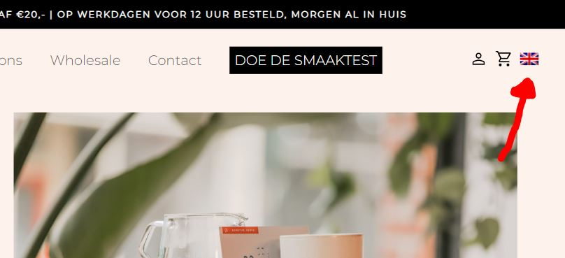

# Procesverslag
Markdown is een simpele manier om HTML te schrijven.  
Markdown cheat cheet: [Hulp bij het schrijven van Markdown](https://github.com/adam-p/markdown-here/wiki/Markdown-Cheatsheet).

Nb. De standaardstructuur en de spartaanse opmaak van de README.md zijn helemaal prima. Het gaat om de inhoud van je procesverslag. Besteedt de tijd voor pracht en praal aan je website.

Nb. Door *open* toe te voegen aan een *details* element kun je deze standaard open zetten. Fijn om dat steeds voor de relevante stuk(ken) te doen.

## Jij

  
uitwerken voor kick-off werkgroep

  ### Auteur:
  Eliran Abohadana
  
  #### Je startniveau:
  Blauw
  
  #### Je focus:
  Responsive 

## Je website

  
uitwerken voor kick-off werkgroep

  ### Je opdracht:
  Nieuwe site: https://www.singleestatecoffee.nl/ > https://xxlnutrition.com/nl/

  #### Screenshot(s) van de eerste pagina (small screen): 
  hier de naam van de pagina  
  

  #### Screenshot(s) van de tweede pagina (small screen):
  hier de naam van de pagina  
  
 

## Toegankelijkheidstest 1/2 (week 1)

  
uitwerken na test in 1e werkgroep

  ### Bevindingen
  Lijst met je bevindingen die in de test naar voren kwamen:
  
  De website is nog niet heel toegankelijk en vooral niet voor gebruikers met een screenreader, geen context bij links/koppelingen en hij skipt over sommige links.

  #### Screenreader
  Veel onderdelen op de site waren erg onduidelijk voor de screenreader. Zoals links naar bepaalde items werd opgelezen als alleen 'koppeling' waardoor het als           gebruiker niet echt duidelijk word waar die koppeling je heen brengt.
  
  Hier een omschrijving van hoe het opgelost kan worden:
  
  alttext of ontzichtbare text bij de link of img

  #### Muis en Toetsenbord 
  De website is prima te bedienen met alleen een toetsenbord of muis. je kan het items aan je winkelmandje toevoegen en het bestel process afronden.

  #### Motoriek (shocks, elastiekjes)
  Het maakt het proces wat lastiger en het duurt wat langer maar je kan gewoon hetzelfde doen.

  #### Visueel (brillen, contrast, kleurenblind, dark/light). 
  In de meeste gevallen is de site nog prima leesbaar maar wanneer het te wazig word valt de tekst een beetje weg en kan je het lastig zien.
  
  Hier een omschrijving van hoe het opgelost kan worden:
  
  Een fontslider waarmee de gebruiker de groote van het tekst kan vergroten/verkleinen.
  

## Breakdownschets (week 1)

  
uitwerken na afloop 2e werkgroep

  ### de hele pagina: 
  

  ### Over ons pagina: 
  

 

## Voortgang 1 (week 2)

  
uitwerken voor 1e voortgang

  ### Stand van zaken
  We hadden het over grid en positionering binnen het grid waardoor ik het nu beter begrijp. ook heb ik van website kunnen wisselen.

  ### Agenda voor meeting
  Deze week was ik nog niet ingedeeld voor een groepje

  | Eliran      | 
  | ---         | 
  |kan ik van website wisselen|

  ### Verslag van meeting
  hier na afloop snel de uitkomsten van de meeting vastleggen

  - betere grip op grid
  - van website gewisseld
  - lid van nieuw groepje

## Voortgang 2 (week 3)

  
uitwerken voor 2e voortgang

  ### Stand van zaken
  De header was nog wel lastig te maken het was een hoop gepuzzel in het begin maar ik heb het gelukkig werkend gekregen.
  
  
  
  De footer maken ging zeer flot alleen wist ik niet of er een betere ccs selector was voor een element dat specifiek voor een ander element komt, zo had ik een h4 die   ik styling wou geven die voor een UL stond. ik heb maar nth of type gebruikt. (::before?)
  
  
  
  section gebruiken of heb je coole css? (:before)
  
  

  ### Agenda voor meeting
  samen met je groepje opstellen
| Maeve      | Nienke          | Thijs    | Eliran       | Tess |
  | ---            | ---                | ---          | ---              | ---      |        
  | Welke css selector moet je gebruiken?| Moet je een secion beginnen bij een h1?             | wanneer gebruik je welke html elementen?    | Moet je bij een page waar je de taal kan switchen een aparte (vertaalde) page maken of gebruik je javascript om de text te veranderen?    |  hoe centreer je een background img |
  | is er een logische indeling voor css? |  |  |  | | 
  | mag je id's gebruiken bij img?           |               |          |              || 

  ### Verslag van meeting
  hier na afloop snel de uitkomsten van de meeting vastleggen

  - een ingbouwde translator/taalswitcher maken kost wel wat werk

## Toegankelijkheidstest 2/2 (week 4)

  
 verrasend genoeg was het opzich zelf al redelijk toegankelijk in alle gevallen kon de gebruiker zijn taak afronden.p

  ### Bevindingen
  Lijst met je bevindingen die in de test naar voren kwamen (geef ook aan wat er verbeterd is):
  - De screenreader is al een verbetering op de orginele website
  - De gebruiker kan prima navigeren met alleen muis of toetsenbord (nummer en email nog niet)
  - De gerbuiker kon de content begrijpen/lezen met visuele beperking

  #### Screenreader
  Hij gaat over alle elementen zonder dingen over te slaan. de items waren een beetje onduidelijk. de links leest ie ook volledig op dus niet dat je alleen het woord     koppeling hoort maar ook waar die koppeling je heen brengt 
  
  Hier een omschrijving van hoe het opgelost kan worden (met indien nodig afbeeldingen)
  alt text bij item img

  #### Muis en Toetsenbord 
  de gebruiker kon prima navigeren op de site met alleen een toetsenbord of muis. Alleen viel het de gebruiker op dat ie niet kon tabben naar het telefoonnummer of       email
  
  Hier een omschrijving van hoe het opgelost kan worden (met indien nodig afbeeldingen)
  Maak het interactief <a>

  #### Motoriek (shocks, elastiekjes)  
  elastiekjes: er waren geen uitgebreide taken op mijn site waardoor de gebruiker zonder al te veel moeite kon navigeren ook waren de knoppen groot genoeg om te         klikken

  #### Visueel (brillen, contrast, kleurenblind, dark/light). 
  De testen gingen grotendeels zonder enkele problemen, de gerbuiker had niet veel last van zijn beperkingen.
  kleurenblind: er is genoeg contrast dus de content is duidelijk genoeg.
  staarbril: er zijn niet teveel elementen tegelijkertijd op het scherm waardoor het zichtbaar blijft en niet te choatisch.
  wazige zicht: text kan soms wat dun zijn waardoor het lastiger is te lezen.
  
  Hier een omschrijving van hoe het opgelost kan worden (met indien nodig afbeeldingen)
  een fontchanger/slider waarmee je de groote/dikte van het font kan aanpassen.
  

## Voortgang 3 (week 4)

  
uitwerken voor 3e voortgang

  ### Stand van zaken

  het ging verassend goed, ik had eerst het probleem dat een Ahref niet mee werkte het overlapte met andere elementen (oplossing was dus inline-block)
  wel begrijp niet waarom fontsize invloed heeft op tusseruimtes bij img's.

  ### Agenda voor meeting
  samen met je groepje opstellen

  | Maeve      | Nienke         | Thijs      | Eliran       |  Tess |
  | ---        | ---            | ---        | ---          | ---   |
  |            |                |            | waarom heeft fontsize invloed op spacing tussen img | hoe gebruik je grid om element posities tegeven, hoe maak ik een carousel    |
  |            |                |            |              |       |
  |            |                |            |              |       |

  ### Verslag van meeting
  hier na afloop snel de uitkomsten van de meeting vastleggen
  
  - door wat tips heb ik mijn nav wat mooier gemaakt (white space: wrap/nowrap)
  - toestemming gekregen voor div (onder bepaalde condities)
  - ik heb wat van andere geleerd (object fit)

## Eindgesprek (week 5)

  
uitwerken voor eindgesprek

  ### Je uitkomst - karakteristiek screenshots:
  Hierbij de homepage! 
  
  - 
  - 
  - 

  ### Dit ging goed/Heb ik geleerd: 
  Ik heb veel geleerd over display grid een flex en wat je ermee kan doen. Grid vind ik dan nog het tofst vooral hoe simpel en met weinig regels code je iets al erg     goed responsive kan maken. Ook begrijp ik wat meer van de selectoren en hoe je bijv daarmee de childs van elemeten een styling kunt geven. En mischien een van de belangrijkste dingen dat ik geleerd heb is dat het zonder 500 div'jes ook kan en dat het vaak makkelijker gaat door semantische elementen te gebruiken. (vroeger maakte ik wel eens een nav/ul uit divjes)

  
  
   
   

  ### Dit was lastig/Is niet gelukt:
  
  door tijdsnood heb ik dit niet werkend kunnen maken, maar het had me wel een leuke toevoeging geweest.
  

## Bronnenlijst

  
continu bijhouden terwijl je werkt

  Nb. Wees specifiek ('css-tricks' als bron is bijv. niet specifiek genoeg).

  1. A11Y hide element class : https://www.a11yproject.com/posts/how-to-hide-content/

